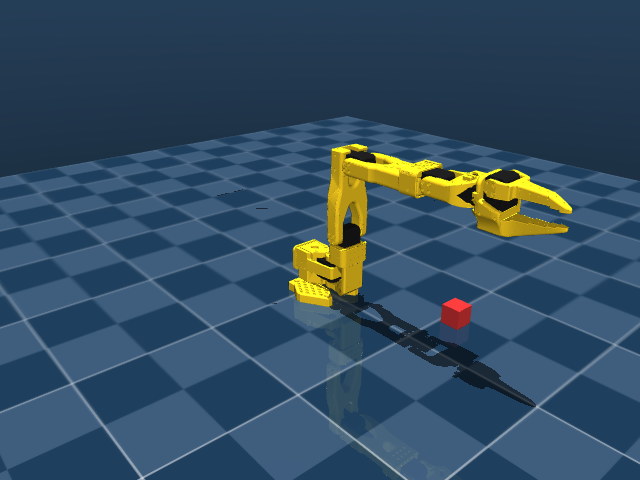
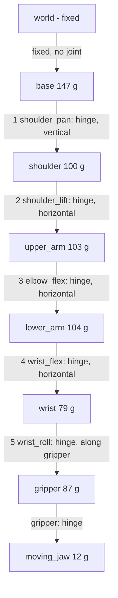

# Lesson 01 — Links, Joints and Degrees of Freedom (SO-101)

**Goal:** understand what the SO-101 is made of, how many independent motions it has, and why that
number (5) is enough for our task. Every claim here is checked in code.

**Run alongside:**
```
python scripts/01_view_robot.py      # interactive viewer with joint sliders
python scripts/02_inspect_joints.py  # prints the tables below from the model + 3 experiments
pytest                               # the same claims as automatic tests
```



---

## 1. Vocabulary

| Term | Meaning | SO-101 example | MuJoCo name |
|---|---|---|---|
| **Link** | A rigid part. It doesn't bend. | upper arm, forearm | `<body>` |
| **Joint** | Connects a link to its parent and allows one kind of relative motion | the elbow | `<joint>` |
| **Revolute (hinge)** | Rotation about a fixed axis, 1 DOF | all 6 SO-101 joints | `type="hinge"` |
| **Prismatic (slide)** | Translation along an axis, 1 DOF | (none here) | `type="slide"` |
| **Free joint** | No constraint at all: 3 translations + 3 rotations = 6 DOF | the cube | `<freejoint>` |
| **Actuator** | The motor that drives a joint | STS3215 servo | `<actuator><position>` |
| **Serial chain** | Links connected one after another, base → tip, no loops | the whole arm | nested `<body>` tags |
| **End-effector / tip** | The frame we care about controlling | between the jaws | site `gripperframe` |

### Degrees of freedom (DOF)
> **DOF = the number of independent numbers needed to fully describe the configuration.**

For a **serial chain of 1-DOF joints**, that's simply the number of joints. (For closed loops,
e.g. a four-bar linkage, you need Grübler's formula instead, because loops remove freedom. Not
needed here.)

Example: a door on a hinge has 1 DOF, one angle describes it. A drawer has 1 DOF too, one
distance. A cube lying loose on the table has 6: position (x, y, z) and orientation (roll, pitch,
yaw).

---

## 2. The SO-101 kinematic tree

MuJoCo describes the robot as nested bodies. Each child body is attached to its parent by a
joint:



The base has no joint, so it's welded to the world. That's what "fixed-base manipulator" means.

### Real numbers (from `scripts/02_inspect_joints.py`, home pose)

| # | Joint | Axis in world frame | Range | Distance to next axis |
|---|---|---|---|---|
| 1 | `shoulder_pan` | (0, 0, **−1**) — vertical | ±110° | 6.5 cm |
| 2 | `shoulder_lift` | (0, 1, 0) — horizontal | ±100° | 11.6 cm (upper arm) |
| 3 | `elbow_flex` | (0, 1, 0) — horizontal | ±96.8° | 13.5 cm (forearm) |
| 4 | `wrist_flex` | (0, 1, 0) — horizontal | ±95° | 16.0 cm to tip |
| 5 | `wrist_roll` | (−1, 0, 0) — along the gripper | −157° … +163° | — |
| – | `gripper` | jaw hinge | −10° … +100° | — |

So: **5 arm DOF + 1 gripper DOF = 6 actuators.** The gripper doesn't count toward arm DOF because it
doesn't move the tip frame. It only opens and closes the jaw.

Three details in these numbers, each of which will cause a bug later if missed:
1. **Pan axis points down (−z).** Right-hand rule: a positive angle turns the arm *clockwise*
   seen from above. Experiment B shows +30° pan → azimuth −30°.
2. **The pan axis isn't at the world origin.** It sits at x = +3.9 cm. Rotation happens about
   that axis, so distances must be measured from it.
3. **"Home" (all zeros) is the middle of each range**, not "arm stretched out". At home, the
   upper arm points up and the forearm points forward (see the picture). This is the "new
   calibration" model.

---

## 3. How many DOF does a task need?

An object's pose in space has **6 numbers**: 3 for position, 3 for orientation.
- To place a tool at *any* position with *any* orientation, you need **≥ 6 DOF**.
- Industrial arms (UR5, ABB IRB) have 6. Franka Panda has 7: the extra one is **redundancy**, which
  lets it avoid obstacles while holding the same tip pose.

But a task often constrains fewer numbers. **Top-down grasping of an object on a table:**

| Pose number | Needed? | Why |
|---|---|---|
| x, y | ✅ | where the object is |
| z | ✅ | go down, lift up |
| pitch | ✅ but fixed | gripper must point straight down |
| yaw | ✅ | align the jaws with the object's sides |
| roll | ❌ | a vertical gripper spinning about its pointing axis *is* the yaw |

So the task needs **x, y, z, yaw with pitch held at −90°**. That's 5 constraints on the tip, and
it needs an arm with **at least 5 DOF**.

### Why 4 DOF isn't enough — worked example
Remove `wrist_roll`. The arm now has pan + three parallel pitch joints.

- Joints 2, 3, 4 all rotate about **parallel horizontal axes**. So they can only move the tip
  **inside one vertical plane**, the plane the arm points in. (Experiment A: 200 random poses of
  these three joints, and the tip's y never changes.)
- Inside that plane they control 3 things: horizontal reach, height, and pitch angle. A planar arm
  with 3 joints = 3 DOF in the plane.
- Pan rotates that whole plane about the vertical axis.

Now put a cube at azimuth 20°, rotated so its sides are at 50°. To reach it, pan must be about
−20° (sign from detail 1). With the gripper pointing down, the jaw direction is set by the
plane, so the jaws line up at **20°, not 50°**. No remaining joint can turn them. The grasp fails,
or only works when the cube happens to line up with the arm.

**Add `wrist_roll`** and the gripper can spin about its own pointing axis. With the gripper pointing
down, that axis is vertical, so roll directly adds to the yaw: **jaw yaw = arm azimuth ± roll** (the
sign depends on the axis direction). Roll by 30° and the jaws line up with the cube. ✅

**Conclusion:** 5 DOF is exactly the minimum for top-down grasps. That's why the SO-101 works well
here. What we can't do: approach from an arbitrary tilted direction with arbitrary roll. That's
a 6-DOF task.

---

## 4. Workspace (preview of inverse kinematics)
Joints 2–4 are a **planar 3-link arm** (11.6 cm, 13.5 cm, 16.0 cm). Ignoring limits, the maximum
reach from the shoulder_lift axis is 11.6 + 13.5 + 16.0 ≈ 41 cm. For a top-down grasp the last
segment must point straight down, so the wrist_flex axis has to sit **about 16 cm above the grasp point**.
The upper arm and forearm (25.1 cm total) then determine how far out that wrist point can go. The
top-down workspace is therefore much smaller than 41 cm. We'll compute it exactly with inverse
kinematics in lesson 03,
and check that the cube's start position (x = 22 cm) really is inside it.

---

## 5. How the model file encodes all this (MJCF anatomy)
Excerpt from `models/so101/so101_new_calib.xml`, simplified:

```xml
<body name="upper_arm" pos="..." quat="...">        <!-- link, placed relative to its parent -->
  <joint name="shoulder_lift" type="hinge" axis="0 0 1" range="-1.745 1.745"/>
  <inertial mass="0.103" pos="..." fullinertia="..."/>   <!-- dynamics: mass, CoM, inertia -->
  <geom type="mesh" mesh="upper_arm_so101_v1" class="visual"/>   <!-- what you see -->
  <geom type="mesh" mesh="upper_arm_so101_v1" class="collision"/><!-- what touches things -->
  <body name="lower_arm" ...> ... </body>             <!-- child link, nested = serial chain -->
</body>
...
<actuator>
  <position name="shoulder_lift" joint="shoulder_lift" kp="998" kv="2.7" forcerange="-3.35 3.35"/>
</actuator>
```

- `axis="0 0 1"` is in the **body's own frame**. It only becomes (0, 1, 0) in world coordinates
  after all the parent rotations (`quat`) are applied. Chaining those transforms is **forward
  kinematics**, lesson 02's topic.
- A `<position>` actuator acts like a servo: it applies a torque ≈ kp·(target − angle) − kv·velocity,
  capped at ±3.35 N·m. The viewer sliders set `target`. You already know this: it's a **PD
  controller**.
- The URDF file (`so101_new_calib.urdf`) describes the same robot in ROS's format. We'll use it in
  Phase 6.

---

## 6. Exercises
Do them in the viewer first, then check with `02_inspect_joints.py`.

1. Move only `shoulder_lift`, `elbow_flex`, `wrist_flex`. Which plane does the tip stay in?
2. Set `shoulder_pan` to +45°. Which way does the arm turn, seen from above? Why?
3. Move only `wrist_roll` by 90°. How far does the tip move? Why isn't it zero?
4. How many numbers are in `data.qpos` for the whole scene, and how many DOF? Explain the
   difference.
5. A cube sits at azimuth 0° (straight ahead), rotated 45°. With the gripper pointing down, which
   joint(s) must change from home to align the jaws, and by how much?
6. *(Thinking)* Why do the three pitch joints being parallel make IK easier than a general 6-DOF arm?

<details>
<summary>Answers</summary>

1. The vertical plane y ≈ 0 (the x–z plane). All three axes are parallel to y, so every point on
   the chain moves in a plane perpendicular to y. (The joint anchors sit at y = −1.8 cm and the tip
   at y = 0, but each point's own y stays constant.)
2. Clockwise. The axis is (0, 0, −1). By the right-hand rule, a positive rotation about −z is
   negative about +z, which means clockwise from above.
3. ≈ 11 mm. The `gripperframe` site is about 8 mm off the roll axis, so it sweeps a small circle.
   Orientation rotates the full 90°.
4. `nq = 13`, `nv = 12`. 6 hinge angles + 7 numbers for the cube's free joint (3 position + a
   4-number quaternion). The quaternion has 4 numbers but only 3 rotational DOF, since it is
   constrained to unit length.
5. Only `wrist_roll`, by +45° or −45°. A square cube looks the same every 90°, so both work, and
   both are well inside the ±157° range. Pan stays 0 because the cube is straight ahead. (Pitch
   joints still have to move to reach down to it, but they don't change the jaw yaw.)
6. The pan angle comes directly from `atan2` of the target's position, and the rest reduces to a
   **2D** triangle problem with the law of cosines. A general 6-DOF arm needs to solve coupled 3D
   equations or iterate numerically.
</details>

---

## 7. Key takeaways
- Link = rigid body; joint = allowed relative motion; serial-chain DOF = number of 1-DOF joints.
- SO-101: **5 arm DOF** (pan, 3 parallel pitches, roll) + gripper.
- Top-down grasping needs x, y, z, yaw with pitch fixed → **5 DOF is the minimum**; roll provides
  the yaw a 4-DOF arm lacks.
- Check the frames: the pan axis points down, it's offset from the origin, and home is mid-range.

**Next — Lesson 02: Forward kinematics.** Rotation matrices and homogeneous transforms. We write
our own FK for the SO-101 and match MuJoCo's tip position to < 0.1 mm.
