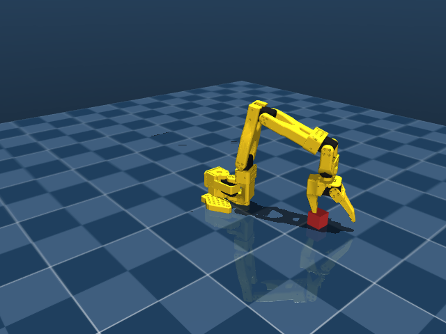
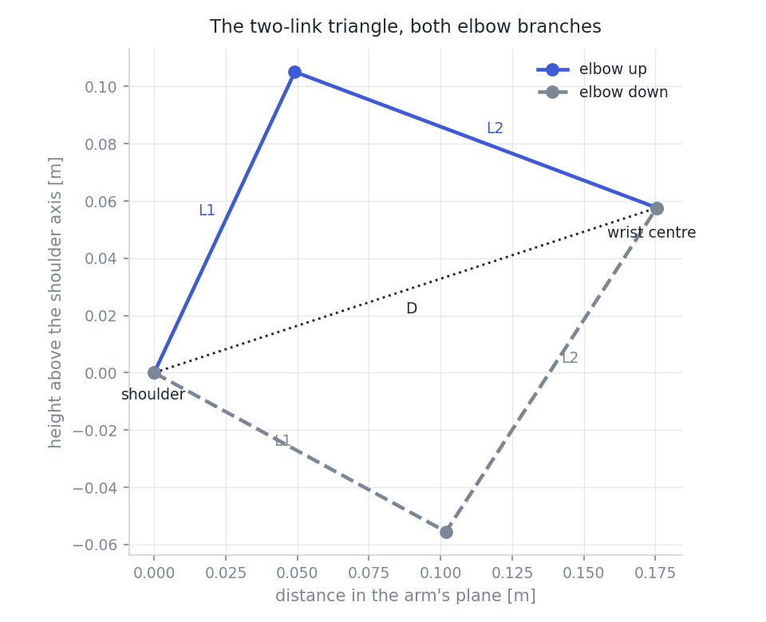
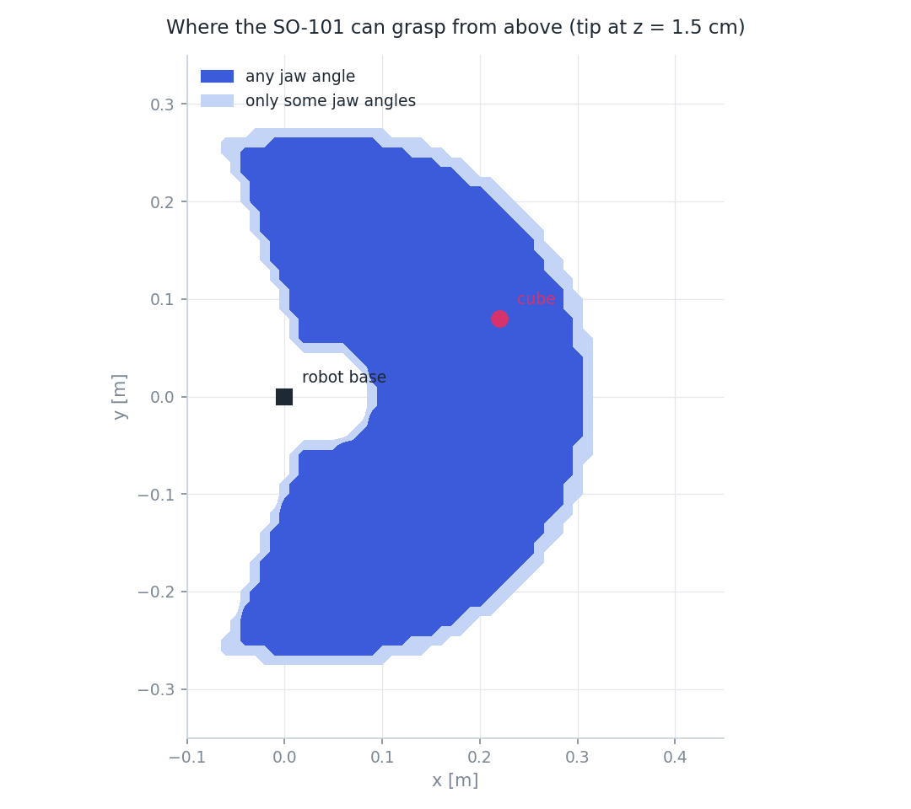

# Lesson 03 — Inverse Kinematics

**The question:** the cube is at (0.22, 0.08) turned 30°. What five joint angles put the gripper
around it, pointing down, jaws aligned?

Lesson 02 went forwards: angles → pose. This lesson goes backwards, which is harder for three
reasons: the equations are nonlinear (sines and cosines of sums), a target may have **several**
answers, and it may have **none**.

**Run alongside:**
```
python scripts/05_inverse_kinematics.py
pytest tests/test_ik.py
```
Code: `src/so101/ik.py`.



---

## 1. Stating the problem properly

We do not need the general 6-DOF problem. Our task is a top-down grasp, so the target is:

- tip position **p** = (x, y, z),
- approach direction (the tip frame's x axis) = (0, 0, −1), straight down,
- jaw yaw ψ: the jaws close along the horizontal direction (cos ψ, sin ψ, 0).

That's 5 numbers for 5 joints — exactly determined, which is why a closed-form answer exists.
`yaw_to_rotation(psi)` builds the target rotation matrix from those rules, and
`test_yaw_to_rotation_is_a_rotation` checks it really is a rotation.

Where do the tip frame's axes come from? From the model, not from a guess: the gripper's jaw hinge
axis is the tip frame's **y**, so the jaws close along **z**, and **x** points out between them.

---

## 2. The trick: decouple position from orientation

The naive approach is to write down the tip position as a function of five angles and solve five
coupled trigonometric equations. Don't. Use the structure lesson 02 uncovered:

1. Joints 2, 3, 4 have **parallel axes** → they move the wrist in one vertical plane.
2. Joints 4 and 5 axes **intersect**, at a point we call the **wrist centre** W.
3. Joint 5's axis **is** the approach axis.

Point 2 is the important one. W lies on both axes, so **turning joint 5 does not move W**. And W is
rigidly attached to the gripper, so if we know the target *pose* of the tip, we know where W must
be:

$$ W = p + R_{\text{target}} \cdot {}^{\text{tip}}W $$

with ${}^{\text{tip}}W = (-0.1592,\ 0.0002,\ 0.0079)$ m — a constant, measured from the model once.

This is called **kinematic decoupling**, and it's the reason industrial arms are built with
intersecting wrist axes. It splits one 5-unknown problem into four small ones:

| Step | Unknown | Method |
|---|---|---|
| 1 | q₁ (pan) | turn the arm's plane to contain W |
| 2 | q₂, q₃ | planar two-link arm reaching W — law of cosines |
| 3 | q₄ | whatever is left to make the approach vertical |
| 4 | q₅ | spin the jaws to yaw ψ |

---

## 3. Step 1 — the pan angle

If the arm's plane passed exactly through the pan axis, this would be one line:
$q_1 = \operatorname{atan2}(W_y, W_x)$. Our arm is 0.18 mm off that plane, so let's do it properly,
because the same algebra covers arms with a real offset (many have several centimetres).

The plane's normal is the pitch-axis direction **n**, which rotates with q₁. The condition "W lies
in the plane" is:

$$ (W - P_{\text{pan}}) \cdot n(q_1) = \ell $$

where ℓ = −0.18 mm is the fixed offset. With $n(q_1) = (\sin q_1,\ \cos q_1,\ 0)$ this becomes

$$ A \sin q_1 + B \cos q_1 = C, \qquad A = v_x,\ B = v_y,\ C = \ell $$

Any equation of this form is solved by collapsing the left side into one sine. With
$r = \sqrt{A^2+B^2}$ and $\varphi = \operatorname{atan2}(B, A)$:

$$ r\sin(q_1 + \varphi) = C \quad\Rightarrow\quad
q_1 = \arcsin\frac{C}{r} - \varphi \quad\text{or}\quad \pi - \arcsin\frac{C}{r} - \varphi $$

**Two solutions**: arm reaching *forwards*, or swung round *backwards* with the elbow folded over.
And a reachability condition falls out for free: if $|C| > r$ there is no solution at all — the
target is too close to the pan axis for the arm's offset to bridge.

---

## 4. Step 2 — the planar two-link arm

Inside the plane, place the origin at the shoulder_lift axis. Two links reach W:

- L₁ = 11.6 cm (upper arm, shoulder→elbow)
- L₂ = 13.5 cm (forearm, elbow→wrist centre)

Let the target in the plane be at distance $D$ and direction $\alpha$ from the shoulder.



The three lengths L₁, L₂, D form a triangle, so the **law of cosines** gives the elbow angle
directly. From $D^2 = L_1^2 + L_2^2 - 2L_1L_2\cos(\pi - \gamma)$, where γ is how far the forearm is
bent away from straight:

$$ \boxed{\ \cos\gamma = \frac{D^2 - L_1^2 - L_2^2}{2L_1L_2}\ } $$

Then the upper arm's absolute angle is the direction to the target, minus the angle by which the
forearm pulls the tip off that line:

$$ \phi_1 = \alpha - \operatorname{atan2}\big(L_2\sin\gamma,\ L_1 + L_2\cos\gamma\big), \qquad
\phi_2 = \phi_1 + \gamma $$

**Two solutions again.** γ and −γ both satisfy the cosine equation (cos is even), mirroring the
elbow across the shoulder–wrist line: **elbow up** and **elbow down**. Combined with the two pan
solutions, and with ψ and ψ+180° both being valid grasps of a square cube, one grasp target has
**up to 8** joint solutions. The script prints all of them.

### Reachability, honestly
The triangle exists only if

$$ |L_1 - L_2| \le D \le L_1 + L_2 $$

- $D > L_1 + L_2 = 25.1$ cm: too far, the arm can't stretch that much.
- $D < |L_1 - L_2| = 1.9$ cm: too close — there's a small dead zone around the shoulder.

Both give $|\cos\gamma| > 1$, which is how the code detects them. **Never** feed an out-of-range
value to `arccos` and clip it silently: you'd get a confident, wrong answer. Clip only after
checking, as `_planar_2r` does.

---

## 5. Step 3 — the wrist angle, and step 4 — the roll

The three pitch joints add up. In the plane, the approach direction's angle is

$$ \phi_{\text{approach}} = \theta_c + q_2 + q_3 + q_4 $$

(θ_c is its value at the home pose, read from the model). We need the approach to be straight down,
so q₄ is simply what's left over:

$$ q_4 = \phi_{\text{down}} - \theta_c - (q_2 + q_3) $$

This is the step that would be impossible on the 4-DOF arm from lesson 01 — there'd be no q₄ to
spend.

For the roll, run FK with q₅ = 0 and compare the gripper's actual rotation with the target:

$$ M = R_{\text{now}}^{\mathsf T} R_{\text{target}} $$

Because the approach direction is already correct, M can only be a rotation *about* that axis, so
reading one angle out of it gives q₅ = atan2(M₃₂, M₂₂). Solving for the last joint by "run FK and
look at what's left" is a standard and perfectly respectable move.

---

## 6. Choosing among the solutions

More answers than you need is a luxury, but you must pick one:

1. **Drop anything outside the joint limits.** Of the 8 branches for our cube, only 1 survives.
   The "backwards" branches need pan angles around ±156°, well outside ±110°.
2. **Among survivors, take the one furthest from its limits** (`limit_margin`). A solution 2° from
   a limit is fragile: any tracking error saturates the joint.
3. Later, when we're moving between poses, we'll add: prefer the solution closest to the current
   joint angles, so the arm doesn't flip posture mid-motion.

For our cube at (0.22, 0.08), yaw 30°:

```
shoulder  elbow  in limits    margin   joint angles [deg]
front     up     True          27.8   [-24.2  11.1  11.7  67.2   8.6]
front     down   False        -62.5   [-24.2 104.6 -159.4 144.7   8.6]
back      down   False        -45.9   [155.9 -105.7 -45.1 -119.2 -171.3]
...
```

Checking the chosen one by FK: position error **0.000 µm**, approach error **2×10⁻⁶ °**. Over 500
random targets on the table, worst case **0.0 nm** and **2.4×10⁻⁶ °**, at about **0.7 ms** per
call including all the branches. That is what "closed form" buys you.

---

## 7. The workspace

Now we can answer lesson 01's open question. Sweep a grid over the table, ask for a top-down grasp
at 1.5 cm height at each point, and record which yaw angles work:



- **1490 cm²** reachable at some jaw angle, **1287 cm²** at every jaw angle.
- Maximum reach about **31 cm** from the base.
- A dead zone near the base: the arm can't fold tight enough to reach straight down beside itself.
- The cube at (0.22, 0.08) is reachable at **all** the yaw angles tested. Good — the scene is fair.
- The thin lighter rim is where only some jaw angles work. It's the outer boundary, where the arm is
  nearly straight and the 7.9 mm tip offset decides between success and failure.

This map is worth keeping: in phase 5 it tells us where to spawn cubes so that "failure" means our
pipeline failed, not that we asked for the impossible.

### How high can the gripper hover, pointing down?
Less than you'd guess, and this changes the plan for lesson 04:

| x along y = 0 | highest top-down pose |
|---|---|
| 0.10 m | 4.0 cm |
| 0.15 m | 8.1 cm |
| 0.20 m | **9.0 cm** (the best anywhere) |
| 0.25 m | 7.7 cm |
| 0.30 m | 2.4 cm |

Above the cube the ceiling is **8.7 cm**. The blocker is `wrist_flex`: holding the gripper vertical
while the wrist rises needs more than its ±95°, and the solver correctly reports no solution. A map
taken at z = 10 cm is completely empty.

So the "approach from above" waypoint in lesson 04 has to sit around 6–7 cm, not the 15 cm you'd
naturally reach for. Discovering this now, from geometry, is much cheaper than discovering it from
a mysteriously failing grasp later.

---

## 8. The general method: Jacobian and damped least squares

Closed-form IK is ideal but fragile — it exists because of this robot's parallel and intersecting
axes. Change the task (approach at 30° instead of straight down) and the derivation has to be
redone. The general method is numerical, and it's worth knowing because it's what MoveIt and most
libraries use.

### The Jacobian
The **Jacobian** J(q) is the matrix that maps joint rates to tip velocity:

$$ \begin{bmatrix} v \\ \omega \end{bmatrix} = J(q)\,\dot q $$

For a revolute joint with axis $z_i$ through point $p_i$, spinning at 1 rad/s while all others are
frozen, the tip moves at $z_i \times (p_{\text{tip}} - p_i)$ and rotates at $z_i$. So each column is:

$$ J_i = \begin{bmatrix} z_i \times (p_{\text{tip}} - p_i) \\ z_i \end{bmatrix} $$

That's the whole derivation — it's a cross product, not calculus, and it comes straight from the FK
frames we already compute. `test_jacobian_matches_finite_differences` checks each column against a
numerical derivative.

### Iterating to a solution
Given a pose error **e** (position difference plus a rotation vector), we want a joint step dq with
J dq = e. J is 6×5 here — 6 things to control, 5 joints — so in general no dq satisfies it exactly.
The usual formula $dq = J^{\mathsf T}(JJ^{\mathsf T})^{-1}e$ doesn't even run for us: $JJ^{\mathsf T}$
is 6×6 but its rank is at most 5, so it is **always** singular here. (Try it: the exercise below
does, and numpy raises `LinAlgError`.) Even on a 6-joint arm it breaks down near a **singularity** —
a pose where J loses rank and some direction of motion becomes unavailable, such as the arm fully
stretched or two wrist axes lined up. There the inverse blows up and asks for enormous joint speeds.

**Damped least squares** (Levenberg–Marquardt) fixes it with one extra term:

$$ dq = J^{\mathsf T}\left(JJ^{\mathsf T} + k^2 I\right)^{-1} e $$

The $k^2I$ term makes the matrix invertible no matter what, so the method works for a 5-DOF arm and
survives singularities. k trades accuracy for stability: the step is capped instead of exploding,
and the price is a small residual error, concentrated in whichever direction the arm cannot move.
Iterate q ← q + dq until the error is small enough.

On our cube target, starting from the home pose, `dls_ik` lands on **the same joint angles as the
closed form** (within 0.001°) in about 6 ms — roughly 10× slower, with no guarantee of finding the
solution you wanted, and it can converge to a different branch depending on where it starts. Hence:
closed form when you have one, numerical when you don't.

The Jacobian's **condition number** at our solution is 26, with a smallest singular value of 0.068.
That's a healthy, non-singular pose. Watch those numbers rise as the arm straightens out.

---

## 9. Exercises

1. Why does the law of cosines give exactly two solutions rather than one or three?
2. The dead zone near the base has radius |L₁ − L₂| = 1.9 cm around the shoulder axis, yet the
   white hole in the workspace map is much bigger than that. What else is excluding those points?
3. Take the chosen solution for the cube and ask for the same position at yaw = 120°. Which joint
   changes most? Why does that make sense?
4. Predict, then check: how does the reachable area change at z = 5 cm, and at z = 10 cm?
5. Use `dls_ik` to solve for a pose our closed-form solver *can't* express: tip at (0.22, 0.08,
   0.10) with the approach direction tilted 30° from vertical. (Hint: build the rotation with
   `rodrigues` and `yaw_to_rotation`.)
6. Run `dls_ik` with `damping=0.0` on any target. What exactly goes wrong, and why is it a
   property of this arm rather than of that particular target?

<details>
<summary>Answers</summary>

1. Because cos is even: cos γ = cos(−γ). Geometrically, the triangle can be folded either way
   across the shoulder–wrist line. Three would need a third intersection of two circles, and two
   circles meet in at most two points.
2. Joint limits, mostly, plus the wrist geometry. Reaching straight down close to the base needs
   the shoulder and elbow folded past ±100° and ±96.8°. The dead zone is about geometry; the hole
   is about limits.
3. `wrist_roll` — it's the joint whose only job is the jaw yaw. The others change by a few
   degrees at most, through the 7.9 mm tip offset moving the wrist centre slightly.
4. 1438 cm² at 1.5 cm, 1169 cm² at 5 cm, and **zero** at 10 cm. Height costs reach, and beyond
   about 9 cm `wrist_flex` runs out of range entirely, so no top-down pose exists at any (x, y).
5. Build R = rodrigues(axis, 30°) @ yaw_to_rotation(psi) with the axis horizontal and
   perpendicular to the approach, then call `dls_ik` with that target. It converges; our closed
   form has no way to express it, because it assumes the approach is vertical.
6. It raises `LinAlgError: Singular matrix` immediately, for every target. With 5 joints,
   $JJ^{\mathsf T}$ (6×6) can have rank at most 5, so it is singular by construction — nothing to
   do with the target. On a 6-joint arm it would run and only break down near singular poses.
</details>

---

## 10. Takeaways
- Decouple first: intersecting wrist axes mean the wrist centre depends only on joints 1–4.
- Pan from a single-sine equation; the planar arm from the law of cosines; the wrist from "what's
  left"; the roll by comparing rotations.
- Multiple solutions are normal — enumerate them, filter by joint limits, then pick with a
  criterion you can state (we use distance from the limits).
- Unreachable is a real answer. Check the triangle inequality instead of clipping `arccos`.
- The Jacobian maps joint rates to tip motion, each column a cross product; damped least squares
  solves IK for any arm and any target, more slowly and with fewer guarantees.

**Next — Lesson 04: making it move.** IK gives poses, not motion. We'll generate a smooth
trajectory through approach → descend → close → lift → place, drive the position servos, and get
our first pick-and-place with a known cube pose. That's the baseline the success-rate metric will
be measured against.
