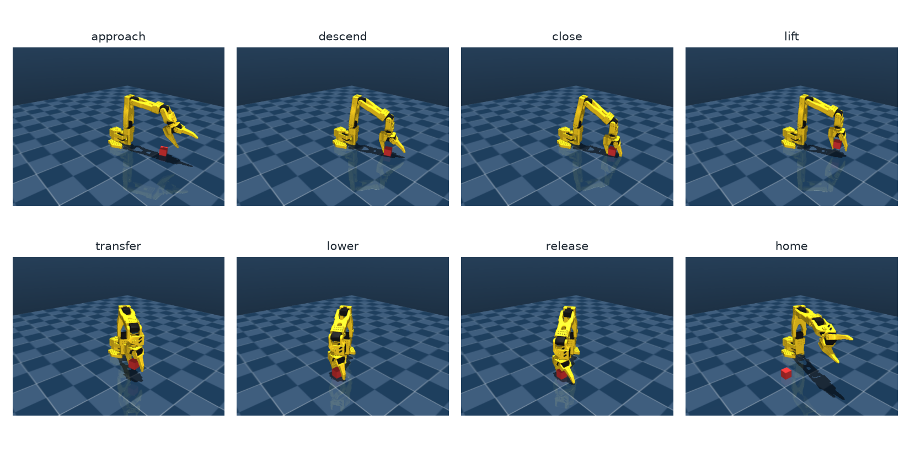
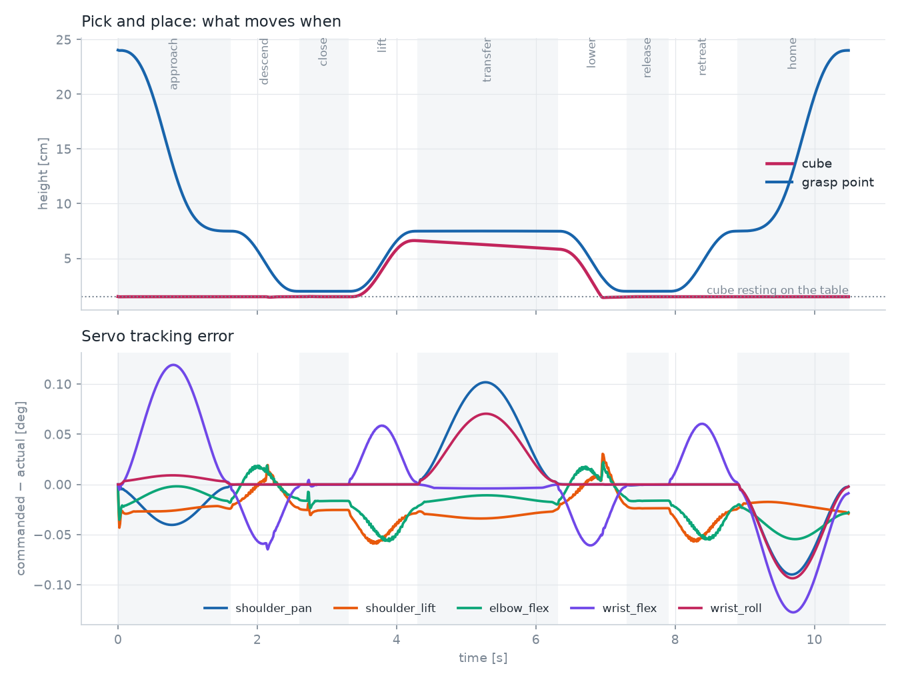

# Lesson 04 — Trajectories, Control, and the First Pick-and-Place

Lesson 03 gives us **poses**. A robot needs **motion**: a joint angle for every instant, smooth
enough for the servos to follow and gentle enough not to knock the cube over. Then it needs to
actually close its fingers on something — which is where simulation stops being tidy geometry and
starts being physics.

**Run alongside:**
```
python scripts/06_pick_and_place.py            # one run, figures, and a 12-trial baseline
pytest tests/test_pick_place.py
```
Code: `src/so101/trajectory.py`, `src/so101/pick_place.py`, `tools/derive_grasp_model.py`.



---

## 1. Why not just command the IK answer?

Set `ctrl` to the grasp pose and the servos will go there — as fast as their torque limit allows,
along whatever path the joints happen to take, arriving with whatever speed they have left. The arm
sweeps through the cube on its way, and slams to a stop.

A trajectory splits the problem into two independent questions:

- **the path** — which poses, in which order, in what shape;
- **the time scaling** — how fast we move along it.

---

## 2. Time scaling: from a straight line to a smooth move

Let s(τ) go from 0 to 1 as normalized time τ goes from 0 to 1, and interpolate

$$ q(t) = q_{\text{start}} + s(t/T)\,(q_{\text{end}} - q_{\text{start}}) $$

The question is what shape s should be.

| Choice | s(τ) | Velocity at the ends | Acceleration at the ends |
|---|---|---|---|
| linear | τ | **jumps** | infinite spike |
| cubic | 3τ² − 2τ³ | 0 ✅ | **jumps** |
| quintic | 10τ³ − 15τ⁴ + 6τ⁵ | 0 ✅ | 0 ✅ |

### Deriving the quintic
We want six conditions: s(0)=0, s(1)=1, s′(0)=s′(1)=0, s″(0)=s″(1)=0. Six conditions need six
coefficients, so try $s = a_0 + a_1τ + \dots + a_5τ^5$.

From the three conditions at τ = 0, immediately $a_0 = a_1 = a_2 = 0$. The three at τ = 1 give

$$ a_3 + a_4 + a_5 = 1,\qquad 3a_3 + 4a_4 + 5a_5 = 0,\qquad 6a_3 + 12a_4 + 20a_5 = 0 $$

Solve: a₃ = 10, a₄ = −15, a₅ = 6. That's `quintic()` in the code.

**Why the acceleration condition matters:** for a motor, acceleration ∝ torque. A cubic starts with
a step in acceleration, which is a step in commanded torque — the arm jolts, and a held object
slides. The quintic ramps torque up from zero.

The price is a higher peak speed: the quintic's fastest moment is **1.875×** the average speed
(`test_quintic_peak_speed_is_1_875_times_average`), against 1.5× for the cubic. Smoothness costs
headroom.

## 3. Path: joint space or Cartesian space?

| | Joint space | Cartesian space |
|---|---|---|
| How | interpolate the joint angles | interpolate the tip position, IK at each knot |
| Tip path | some curve, unpredictable | a straight line |
| Cost | one IK call | one IK call per knot |
| Risk | may sweep through obstacles | may leave the workspace mid-path |

Our rule: **joint space for free space, Cartesian for the parts where the shape matters**. Lowering
onto a cube must be straight down, or the fingers knock it over on the way in. Moving from above
the cube to above the target is free space, so joint interpolation is fine and cheaper.

`cartesian_segment` samples 25 knots, and at each one picks the IK branch **closest to the previous
knot**. Without that, a branch flip halfway down would send the arm through a violent reconfiguration
while its fingers are around the cube.

## 4. The motion

```
approach  1.6 s   joint space, home -> 5.5 cm above the cube, jaws open
descend   1.0 s   CARTESIAN straight down to the grasp height
close     0.7 s   hold still, command the jaws shut
lift      1.0 s   CARTESIAN straight up
transfer  2.0 s   joint space, over to the target
lower     1.0 s   CARTESIAN straight down
release   0.6 s   hold still, open the jaws
retreat   1.0 s   CARTESIAN straight up
home      1.6 s   joint space back to home
```

That's a small state machine, and `Trajectory.at(t)` walks it. Total 10.5 s of simulated time, which
MuJoCo computes in about **0.2 s** — 50× faster than real time, which is what makes a 100-trial
evaluation practical later.



The top panel shows the story: the grasp point descends, the cube's height follows it up during the
lift, and both come down at the target. The bottom panel is the servo tracking error.

## 5. Control: how well do the servos follow?

Each joint is driven by a MuJoCo `position` actuator — a PD controller:

$$ \tau = k_p\,(q_{\text{des}} - q) - k_v\,\dot q, \qquad
\text{clamped to } |\tau| \le 3.35\ \text{N·m} $$

with kp = 998, kv = 2.73 for the STS3215. You already know this controller from your degree; what's
new is reading its behaviour off a plot.

- **Peak error 0.13°** during the fastest part of the transfer. That's lag, not sloppiness:
  a PD controller needs an error to produce torque, so a moving target is always chased.
- **Settled error 0.02–0.03°** at the end of every segment — that's the steady-state error holding
  the arm against gravity, ≈ τ_gravity/kp.
- The error peaks look like the **derivative** of the motion, because with a smooth reference the
  dominant term is velocity lag: e ≈ q̇/(kp/kv).

Both numbers are tiny because we move slowly. Torque saturation is the thing to watch: at 3.35 N·m,
a pose that needs more holding torque simply sags, and no gain will fix it. We hit exactly that
while debugging (section 7, bug 3): the arm pressed a pad into the table, the shoulder saturated,
and the gripper sat **1 cm** below its commanded height.

## 6. The gripper

A position-controlled gripper has to be told *how far to close*, and "fully closed" is wrong: with a
3 cm cube between 1.7 cm jaws you are asking the solver for 1.3 cm of penetration, and the cube
squirts out like a watermelon seed.

So we measure the pad separation as a function of the jaw angle, and invert it:

| jaw angle | pad gap |
|---|---|
| 0° | 0.27 cm |
| 15° | 1.76 cm |
| 26° | 2.90 cm |
| 40° | 3.62 cm |
| 55° | 4.33 cm |

`jaw_angle_for_gap(model, data, gap)` interpolates this. For a 3 cm cube we open to
**52°** (4.2 cm — room to drop over the cube) and command **23°** (2.6 cm — about 4 mm tighter than
the cube, so the servo keeps pressing). The grip force is then the servo's stall torque through the
jaw linkage, which is the same way a real gripper without force sensing works.

## 7. Four bugs, or: why "it should just work" didn't

The first four attempts at this lesson failed, each for a reason worth more than the code.

### Bug 1 — MuJoCo collides meshes as convex hulls
The cube was shoved aside on the way down, every time. The SO-101's fixed-finger mesh wraps around
the jaw hinge; its **convex hull** therefore fills the entire space between the fingers. As far as
the physics engine was concerned, the gripper was a solid block.

Mapping the free space with a small probe object made it obvious. The fix is standard practice:
keep the meshes for rendering, switch their collisions off, and give each finger an explicit box
**pad** on its real inner face (`tools/derive_grasp_model.py` writes
`models/so101/so101_pick_place.xml`; the upstream file stays untouched). Upstream had already hit
the same class of problem — their README notes the base collision meshes were removed for it.

**Lesson: in a physics engine, a mesh is not the shape you see. Check what the collider actually is.**

### Bug 2 — the grasp frame is not the IK frame
The model's `gripperframe` site sits at the wrist output, not between the fingers. Asking IK to put
*that* at the cube puts the fingers 3 cm past it. The grasp point is a fixed offset in the tip frame,

    GRASP_OFFSET = (-0.030, 0.000, 0.014) m

measured from the pad geometry and then confirmed by grid-searching offsets that actually lift the
cube.

The offset also interacts with lesson 03's half-turn symmetry. ψ and ψ+180° are the same grasp for a
square cube, but the grasp point is **off** the roll axis, so turning the jaws over moves it: the
cube was being set down 2.8 cm from the target. `TopDownIK.grasp` now builds a separate tip target
for each yaw. `test_grasp_offset_survives_the_half_turn` locks that in.

### Bug 3 — the pad reached below the table
With the pads 6 cm long and centred 2 cm behind the fingertips, the lower pad stuck 1 cm *past* the
fingertip point, i.e. below the table at grasp height. The arm pushed into the table, the shoulder
servo saturated at 3.35 N·m, and everything ended up 1 cm high — enough that the cube sat at the
very tips of the fingers and slipped out.

Shortening the pads to 3 cm and pulling them back to end 1.5 cm short of the fingertip gives 5 mm of
table clearance. Tracking error dropped from **3.3° to 0.13°** and the placement error from 6.9 mm
to 1.1 mm. `test_pads_clear_the_table_at_the_grasp_pose` guards it.

### Bug 4 — an angular jaw wedges objects out
The SO-101's moving jaw swings on a hinge, so two flat pads are parallel at **exactly one angle**.
At any other angle they meet the cube along an edge, and squeezing then drives the cube out of the
jaws. Grip either failed entirely or depended bizarrely on how hard we squeezed.

Fix: pre-rotate the moving pad by 26°, the angle at which a 3 cm object is held, so the faces are
parallel when it matters. Real grippers do this with angled or compliant fingertips. After this, the
grasp worked across every squeeze value we tried — the mark of a fix that addresses the cause rather
than tuning around it.

## 8. Results: the baseline

The success rule from the project brief: lifted ≥ 3 cm, ends inside a 4 cm × 4 cm target zone,
resting on the table.

**25/25 successful** (95% Wilson interval 87–100%), mean placement error **2.1 mm**, worst 3.4 mm,
over cubes at random positions and yaws inside the workspace map from lesson 03.

Note what this number is and isn't. The pipeline is being handed the cube's exact pose, so it
measures the *motion* only. When vision replaces ground truth in lesson 05, the gap between the two
numbers is exactly the perception error — which is why measuring this baseline first is worth the
trouble.

(The Wilson interval is used rather than the textbook ±1.96√(p(1−p)/n), which returns a nonsensical
±0 when every trial passes.)

## 9. Exercises

1. Plot `cubic` and `quintic` and their first two derivatives over τ ∈ [0, 1]. Where is each one's
   peak speed, and by how much do they differ?
2. Make the transfer segment 4× faster (`speed=4.0`) and re-run. What breaks first: tracking error,
   the grip, or the placement?
3. Replace the `descend` Cartesian segment with a joint-space one and watch the filmstrip. Does the
   grasp still work? Why is it riskier?
4. Set the closing command to the jaw's hard limit instead of `jaw_angle_for_gap`. What happens, and
   which of the four bugs does it reproduce?
5. The cube is 20 g. Change its mass to 200 g and find the mass at which the grasp starts slipping.
   Then work out the friction coefficient the pads would need.
6. Where does the 2.1 mm placement error come from? List three candidate sources and design a
   measurement that separates them.

<details>
<summary>Hints</summary>

1. Both peak at τ = 0.5; the quintic peaks at 1.875 and the cubic at 1.5, and the cubic's
   acceleration is discontinuous at both ends.
2. Tracking error grows roughly linearly with speed; the grip is the first thing to fail, because
   the inertial force on the cube grows with the square of the speed.
4. It reproduces bug 4's symptom through bug 1's mechanism: the solver is asked for an impossible
   penetration and the cube is expelled.
6. Candidates: the cube shifting inside the jaws during the carry, the release drop from the pad
   height, and IK/servo error at the place pose. Log the cube's pose in the tip frame over time to
   separate the first from the rest.
</details>

## 10. Takeaways
- A trajectory = a path + a time scaling. The quintic is the default because it starts and stops
  with zero acceleration; you pay 1.875× peak speed for it.
- Joint space for free motion, Cartesian for the segments whose shape matters, with branch
  continuity between IK solutions.
- A PD position servo always lags a moving target; the errors you see are velocity lag plus a
  gravity-dependent steady-state offset. Torque saturation is a wall, not a gain problem.
- A position-controlled gripper needs to know how wide to close; measure the geometry and invert it.
- Simulated physics has its own failure modes — convex hulls, frames that aren't where you assume,
  geometry that hits the table, wedge effects. Debug them by measuring, not by tuning constants.

**Next — Lesson 05: vision.** A camera above the table, the pinhole model, calibration, finding the
cube and its yaw in the image, and converting pixels to world coordinates. Then we swap ground truth
for perception and see what the success rate does.
